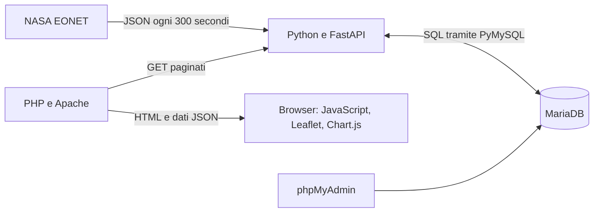

# Documentazione tecnica

## Obiettivo e architettura

Il sistema acquisisce eventi naturali da NASA EONET, li memorizza in MariaDB e li presenta attraverso un'API di consultazione e una dashboard con filtri, grafici, mappa e tabella.

Docker Compose definisce quattro servizi: `db`, `api`, `web` e `phpmyadmin`. L'API usa Python 3.12; il frontend viene servito da PHP 8.3 con Apache. Il volume `db_data` conserva i dati tra i riavvii. Le porte HTTP sono associate a `127.0.0.1`; il database è raggiungibile sulla rete interna dei container.

## Organizzazione del codice

| File | Responsabilità |
| --- | --- |
| `api/main.py` | Endpoint, validazione, ciclo di acquisizione e gestione degli errori |
| `api/database.py` | Connessioni, query parametrizzate, conversione e salvataggio dei dati |
| `api/schema.sql` | Creazione delle sette tabelle |
| `app/src/index.php` | Lettura paginata dell'API e generazione della pagina |
| `app/src/app.js` | Filtri, conteggi, grafici, mappa e tabella |
| `app/src/style.css` | Presentazione della dashboard |
| `Dockerfile` e `compose.yaml` | Build, servizi, configurazione e persistenza |

## Acquisizione e persistenza

All'avvio l'API esegue lo schema con `CREATE TABLE IF NOT EXISTS`, poi avvia una sincronizzazione in background. Ogni ciclo richiede `status=all` e `limit=500` all'indirizzo configurato in `NASA_EVENTS_URL`. Il timeout HTTP è di 30 secondi. Il periodo obiettivo tra gli inizi dei cicli è 300 secondi; un ciclo più lungo viene seguito dal successivo senza ulteriore attesa.

Il sistema inserisce o aggiorna gli eventi in base all'identificativo NASA. Per ciascun evento ricevuto sostituisce associazioni e geometrie nella stessa transazione. Un errore annulla la transazione; l'esito viene registrato separatamente in `sync_runs`. Gli eventi non presenti nella risposta non vengono eliminati. Il contatore `records_updated` conta gli eventi già esistenti elaborati, anche quando i loro valori non cambiano.

Le date provviste di fuso orario vengono convertite in UTC e salvate senza offset. Le coordinate sono conservate in JSON; per i punti vengono anche estratte longitudine e latitudine, mentre per le geometrie vengono calcolati minimi e massimi delle coordinate.

Il [diagramma ER](schema-er.md) documenta lo schema esistente. Il [database di consegna](../database/README.md) contiene un'esportazione dei dati e le istruzioni di ripristino.

## API

| Metodo e percorso | Parametri e comportamento |
| --- | --- |
| `GET /` | Informazioni sul servizio |
| `GET /health` | Connessione DB, intervallo ed esito dell'ultima sincronizzazione |
| `GET /api/events` | `status=all` di default (`open`, `closed`, `all`); `limit=100` di default, tra 1 e 500; `offset=0` di default, non negativo |
| `GET /api/events/{event_id}` | Singolo evento, identificativo da 1 a 100 caratteri |

L'elenco restituisce un array JSON; il dettaglio un oggetto. Ogni evento include categorie, fonti, geometrie, stato derivato da `closed_at` e data dell'ultima geometria. Gli eventi sono ordinati per ultima rilevazione e aggiornamento, entrambi decrescenti. `magnitudeValue`, quando presente, viene serializzato come stringa. La documentazione interattiva è disponibile in `/docs` e lo schema OpenAPI in `/openapi.json`.

Gli errori usano `{"detail":"messaggio"}`: `404` per evento inesistente, `422` per parametri non validi e `503` per indisponibilità del DB. `/health` può restituire HTTP 200 anche quando l'ultima acquisizione NASA è fallita: occorre leggere anche `last_update.status`. Il primo aggiornamento è asincrono, quindi inizialmente l'elenco può essere vuoto.

## Dashboard

PHP legge tutte le pagine dell'API locale, con 500 eventi per richiesta, e incorpora i dati nell'HTML. JavaScript filtra i dati già caricati. Il periodo e il grafico temporale si basano sull'ultima rilevazione, non sulla data di inizio dell'evento. Il filtro per tipo considera soltanto la prima categoria, anche se il database ne supporta più di una.

La mappa visualizza le geometrie mediante Leaflet; Chart.js produce i grafici. Librerie e tessere OpenStreetMap richiedono accesso a Internet. Per vedere nuove acquisizioni bisogna ricaricare la pagina: la dashboard non esegue aggiornamenti automatici.

## Configurazione e limiti

Le credenziali vengono lette dall'ambiente e `.env` è escluso da Git. Le query usano parametri SQL; i testi esterni vengono codificati prima dell'inserimento nell'HTML. Gli endpoint pubblicano soltanto dati in lettura e non prevedono account o JWT.

L'importazione NASA è limitata a una risposta di 500 eventi e non costituisce un archivio completo. Le geometrie vengono sostituite e non hanno uno storico delle revisioni. I metadati descrittivi delle fonti non vengono acquisiti; per le categorie vengono popolati ID e titolo. Le query di dettaglio vengono ripetute per ogni evento, con possibili costi crescenti su elenchi ampi. La paginazione non garantisce uno snapshot stabile durante aggiornamenti concorrenti.

La configurazione corrente avvia un solo processo API: più worker avvierebbero cicli di sincronizzazione indipendenti. Le modifiche future allo schema richiederanno migrazioni, perché `CREATE TABLE IF NOT EXISTS` non aggiorna le tabelle esistenti.

## Verifica manuale

1. Seguire l'avvio nel README e controllare `docker compose ps`.
2. Aprire `/health` e attendere `last_update.status` uguale a `success`.
3. Richiedere `/api/events?limit=1`, poi il dettaglio di un ID restituito.
4. Verificare che `limit=0` restituisca `422` e un ID inesistente restituisca `404`.
5. Aprire la dashboard su porta 8080 e provare i filtri confrontando conteggi, tabella e grafici.
6. Per la riproduzione indipendente dalla NASA, seguire il ripristino SQL documentato nella cartella `database`.
