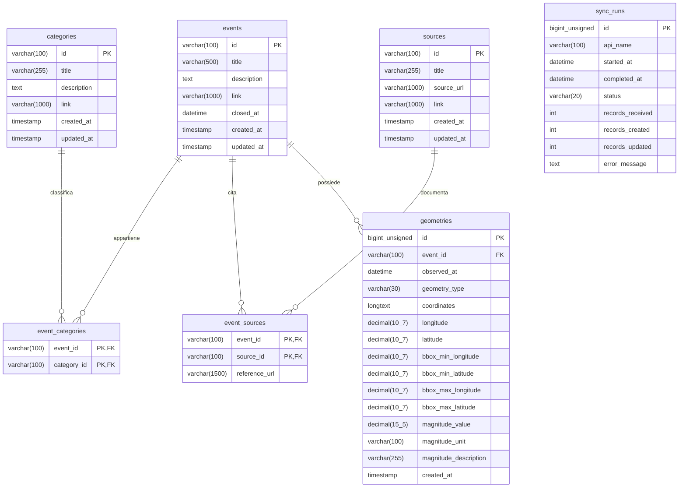

# Schema del database

Il diagramma documenta lo schema già esistente in [api/schema.sql](../api/schema.sql), senza modificarlo. Il database utilizzato è MariaDB 11.4.

`PK` indica la chiave primaria; `FK` la chiave esterna. `||--o{` indica una relazione uno a zero o molti. Le chiavi delle tabelle associative sono composte: eventi e categorie, così come eventi e fonti, hanno relazioni molti a molti. Ogni geometria appartiene a un solo evento. `sync_runs` registra le sincronizzazioni e non ha chiavi esterne verso le altre tabelle.

Nel diagramma `decimal(10_7)` e `decimal(15_5)` rappresentano rispettivamente i tipi SQL `DECIMAL(10,7)` e `DECIMAL(15,5)`. Gli identificativi numerici di geometrie e sincronizzazioni sono auto-incrementali. Tutte le chiavi esterne prevedono `ON DELETE CASCADE` e `ON UPDATE CASCADE`.

`closed_at` nullo identifica un evento aperto. Le coordinate sono conservate come testo JSON con vincolo `JSON_VALID`; longitudine, latitudine e limiti geografici sono valori derivati. Sono presenti indici espliciti su `events.closed_at` e `geometries.event_id`. Nullabilità, valori predefiniti e definizione SQL esatta sono consultabili nello schema sorgente.
