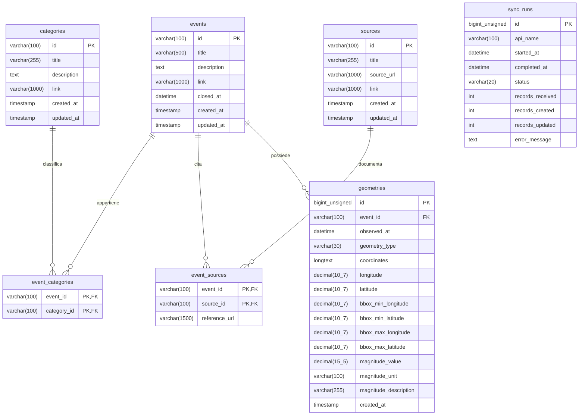

# Schema del database

Il diagramma documenta lo schema già esistente in [api/schema.sql](../api/schema.sql), senza modificarlo. Il database utilizzato è MariaDB 11.4.

`PK` indica la chiave primaria; `FK` la chiave esterna. `||--o{` indica una relazione uno a zero o molti. Le chiavi delle tabelle associative sono composte: eventi e categorie, così come eventi e fonti, hanno relazioni molti a molti. Ogni geometria appartiene a un solo evento. `sync_runs` registra le sincronizzazioni e non ha chiavi esterne verso le altre tabelle.

Nel diagramma `decimal(10_7)` e `decimal(15_5)` rappresentano rispettivamente i tipi SQL `DECIMAL(10,7)` e `DECIMAL(15,5)`. Gli identificativi numerici di geometrie e sincronizzazioni sono auto-incrementali. Tutte le chiavi esterne prevedono `ON DELETE CASCADE` e `ON UPDATE CASCADE`.

`closed_at` nullo identifica un evento aperto. Le coordinate sono conservate come testo JSON con vincolo `JSON_VALID`; longitudine, latitudine e limiti geografici sono valori derivati. Sono presenti indici espliciti su `events.closed_at` e `geometries.event_id`. Nullabilità, valori predefiniti e definizione SQL esatta sono consultabili nello schema sorgente.

Per consultare la rappresentazione grafica interattiva dello schema, è possibile [aprire il diagramma su Mermaid Live](https://mermaid.live/edit#pako:eNq9Vstu2zAQ_BWBpwZwAsmJHtC1RS-59FwYIGhyoxARSYGkDLuO_70rWX7IDh0jNaqLTO3scHa5Q3hNuBFASgL2h2SVZWpmZzrCBxagvYve3-_vzXq7opx5qIyV4KIyYk3DrJegYZdyFA6n8Zo5J18kZ5d2cqa1fIuXfo_cfQ1AheGtwk8B5gqMAj_IaAyqANFrP4Gvd-vuWTDLX5n9lsTxXSRF9Ov5o2jaRb30NRxHPSx9JMBxKxsvjQ7wYmot9dtxVGDHvFSA3TIOBGV-xIsR55lqIm4BkeF424iT-OaDw_pCwdM0vWnBNylpNwk3q2eseUtPW1v_57rOXBQucAvty5z8fA7CBq7VGfJkz887euWGQ-8u4noTWXgBC3rc572qIwuPJM1lJVFGq52sNIjwOY81j4XsTWfmDuzi7Kx2HI9IMQhZUb9qRiNTG131NuDGWCE1crrRJsClYjUKofldj5a-FXABwvwniPncLKmSml7BdsBeScuW19N22Eu0KUWTKVbpHkIXrG4heEgHXIvvoGcPsMC9c8mBh5tjpTm1OD7_MlaskVQzBR_OFEqw5_Y_3PNGNTX44MxNOw955tvRMKE4NAzHQXMU3yBxaEPxofpQeLh-zm5zsNZYii10rIJR38iEVFYKUr6w2sGEKLCKdWuy7lAz4l8Bm0FK_CmYfZuRmd5gUsP0b2MUKb1tMc2atnrdk2xlDH9F9hDQAux302pPyiTuKUi5JstulTzEeRFP0yLJizxJJmSFX9PiocjSZJqn2eNTnqXZZkL-9JvGD1mRxxnmZcVTmhTTzV-xM9ut).